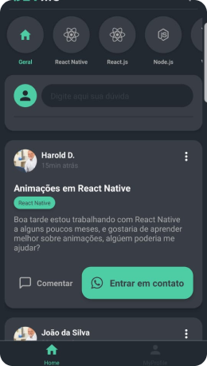
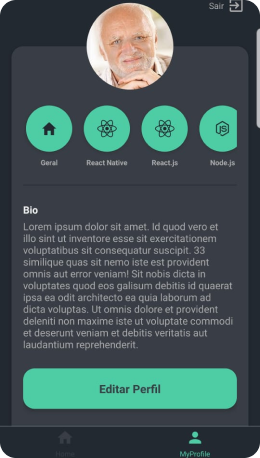

# Devme mobile

## Table content
- [About](#about)
- [Screens](#screens)
- [Technologies](#technologies)
- [How to install](#how-to-install)


## About
DEVme is a project with a focus on network generation, in this network you can interact with the posts of several DEVs, in addition to being able to contact them directly via whatsapp.
Main goals:
- Share experiences
- Increase network
- Ask questions

## Screens






## Technologies
- [Expo](https://expo.io/)
- [React Native](https://reactnative.dev/docs/getting-started)
- [Javascript](https://devdocs.io/javascript/)
- [Json-server](https://github.com/typicode/json-server)

## How to install
```bash
# Install dependencies
$ yarn

# Run Json server with localhost
$ json-server --host <YOUR_IP> --port 3000 ./db.json --watch

# Run expo
$ yarn start
```
